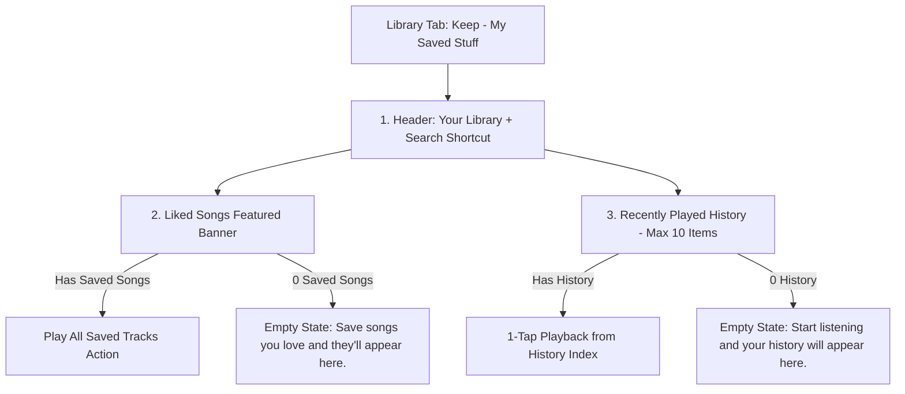

# Jamkudi Library Screen - Feature & Visual Architecture Documentation

The **Library Screen** (`src/app/(tabs)/library.tsx`) fulfills Jamkudi's **"Keep"** tab mental model (*"My saved stuff & listening history"*). It manages persistent **Liked Songs** and real-time **Recently Played** listening history.

---

## 1. 3-Tab Product Mental Model

- **Home Screen**: **Discover** (*"What should I listen to?"*)
- **Search Screen**: **Find** (*"I know what I want."*)
- **Library Screen**: **Keep** (*"My saved stuff & listening history."*)

---

## 2. Comprehensive Feature Breakdown

### 2.1 Top Header
- **Visual Presentation**: Header text **Your Library** (`text-2xl font-bold`).
- **Search Shortcut**: Quick search icon button linking directly to the Search tab (`router.push("/(tabs)/search")`).

---

### 2.2 Section 1: Liked Songs Card
- **Visual Presentation**: Prominent purple gradient banner (`bg-purple-900/60` / `#4C1D95`, `rounded-3xl`, `p-5`).
- **Dynamic Stats**:
  - Displays real saved track count (`likedTracks.length`).
  - If `likedTracks.length > 0`: Displays *"X saved tracks"* with a Play button overlay.
  - If `likedTracks.length === 0`: Displays *"No liked songs yet • Save songs you love and they'll appear here."*
- **Action**: Tapping the card populates `likedTracks` into the active queue and starts playback.

---

### 2.3 Section 2: Recently Played History (Max 10)
- **Purpose**: Displays the user's real listening history recorded locally across app sessions.
- **Display Limit**: Capped at the latest **10 tracks** to prevent infinite scrolling.
- **Empty State**: Displays *"Nothing played yet • Start listening and your history will appear here."*
- **Data Provider**: `recentlyPlayed` array from `PlayerContext` (persisted in `AsyncStorage`).

---

## 3. Summary Component Matrix

| Component | User Interaction | Action Executed | Provider / Storage |
| :--- | :--- | :--- | :--- |
| **Search Icon Shortcut** | Tap icon | Navigates to Search tab | `router.push("/(tabs)/search")` |
| **Liked Songs Card** | Tap card | Plays all saved Liked Songs | `PlayerContext.likedTracks` (AsyncStorage) |
| **Recently Played Row** | Tap song row | Plays track from history index | `PlayerContext.recentlyPlayed` (AsyncStorage) |
