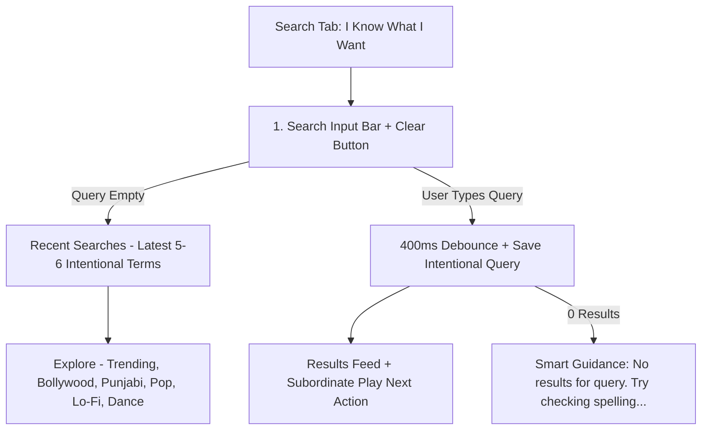

# Jamkudi Search Screen - Feature & Visual Architecture Documentation

The **Search Screen** (`src/app/(tabs)/search.tsx`) serves as Jamkudi's *"I know what I want"* find-and-browse tool. It provides 400ms debounced catalog search, intentional search history isolation, Explore taxonomy, smart zero-results guidance, and subordinate **Play Next** queue insertion.

---

## 1. Product Philosophy: Home vs. Search

- **Home Screen**: *"What should I listen to?"* (Personalized + Mood Engine + Discovery).
- **Search Screen**: *"I know what I want."* (Instant Search + Explore + Queue Actions).

---

## 2. Comprehensive Feature Breakdown

### 2.1 Intentional Search History Guard
- **Behavior**:
  - `addSearchQuery()` is strictly executed when the user **manually types a query** into the search input box.
  - Category pill taps (*Bollywood*, *Punjabi*, *Trending*) load the category feed without writing internal API strings to recent searches.
  - Recent searches display is capped at the **latest 5–6 items** horizontally.
  - Includes a 1-tap **Clear** button calling `clearSearchHistory()`.

---

### 2.2 Explore Taxonomy
- **Section Label**: **Explore** (replacing generic category headers).
- **Pills Bar**: `Trending` · `Bollywood` · `Punjabi` · `Pop` · `Lo-Fi` · `Dance`.
- **Active Pill Highlight**: Neon purple fill (`bg-purple-600 border-purple-500` with bold white text).

---

### 2.3 Smart Zero-Results & Empty States
- **Smart Zero-Results Guidance**:
  - Displays actionable user guidance when 0 results match a query:
    *"No results for '{query}' • Try checking the spelling or search for an artist, song, or album."*
- **Clean Empty Search Guidance**:
  - Displays welcoming user guidance when the catalog has not been queried yet:
    *"Search for a song, artist, or album, or pick a category above to explore."*

---

### 2.4 Subordinate "Play Next" Action
- **Primary Row Action**: Tapping any song row populates the search results feed into the queue (`playQueue(results, index)`) and opens the full player modal.
- **Subordinate Action**: "Play Next" pill (`px-2 py-1 rounded-full bg-white/5 border border-white/10`) inserts the track **immediately after the currently playing song in the queue** without interrupting current playback, triggering a success toast notification.

---

## 3. Summary Component Matrix

| Component | Interaction | Behavior | Data Provider |
| :--- | :--- | :--- | :--- |
| **Search Input Bar** | Manual typing | 400ms debounced search & saves query | JioSaavn API + `AsyncStorage` |
| **Recent Searches** | Tap term chip | Populates search input | `AsyncStorage` (Max 6 terms) |
| **Explore Pills** | Tap category | Filters feed without saving history | JioSaavn API (`searchSongs`) |
| **Song Item Row** | Tap song row | Plays queue & opens player modal | `PlayerContext.playQueue()` |
| **Play Next Button** | Tap "Play Next" | Inserts track into next queue slot | `PlayerContext.playNext()` |
